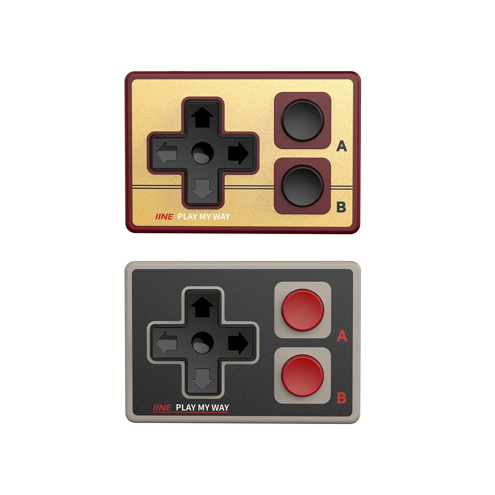
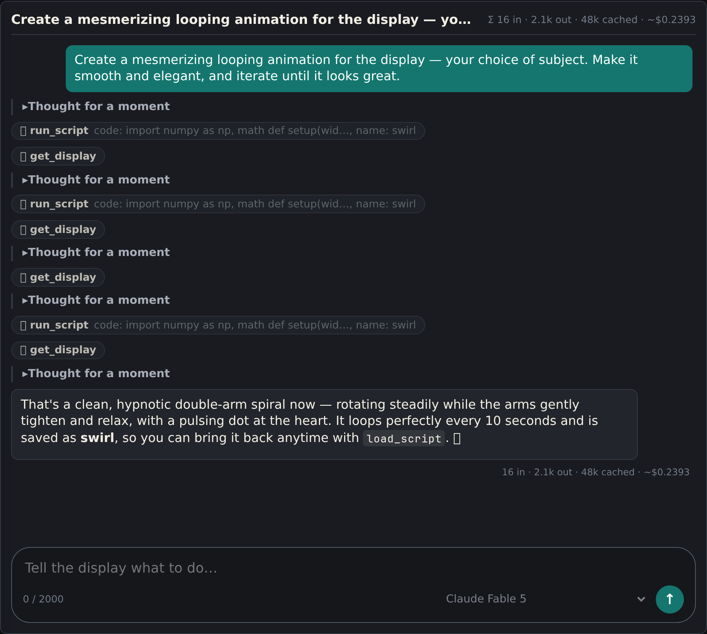
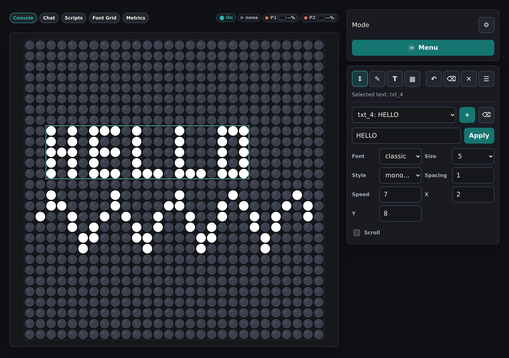
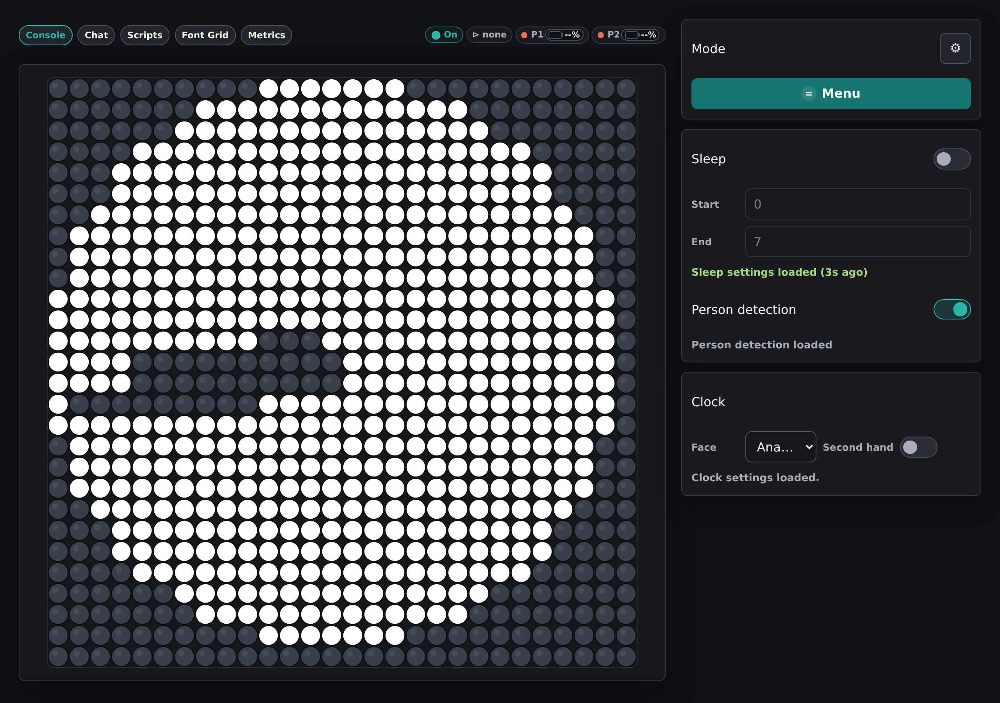
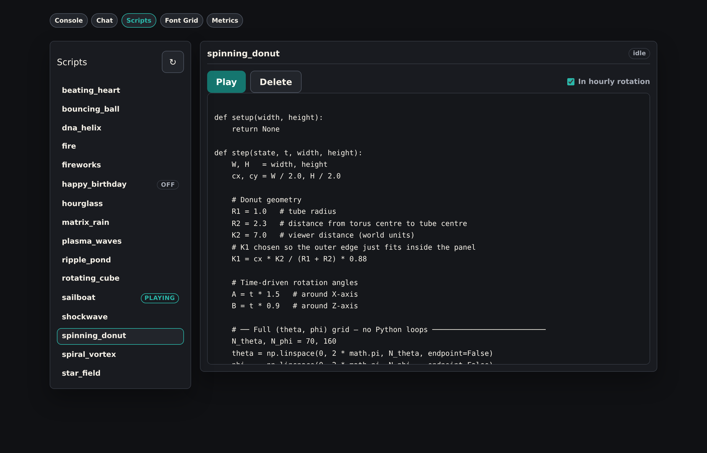
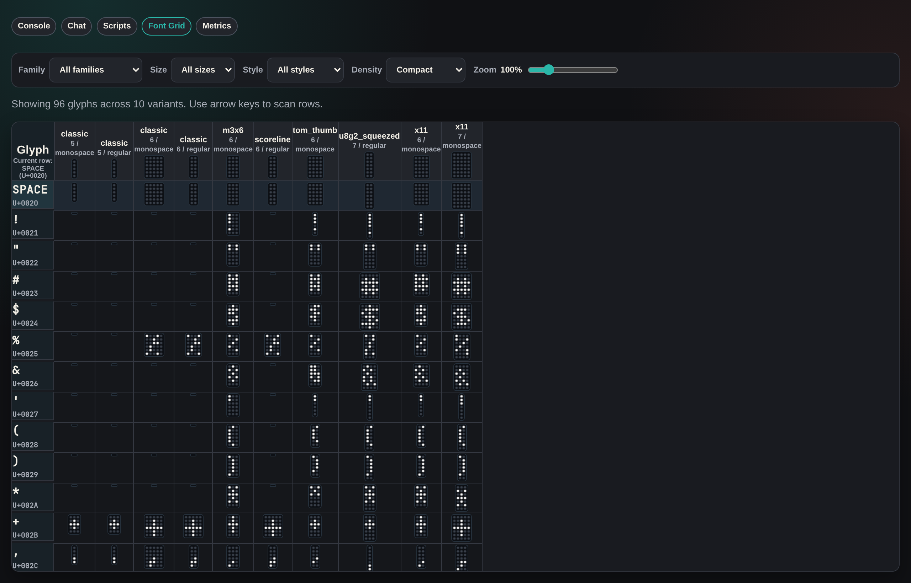
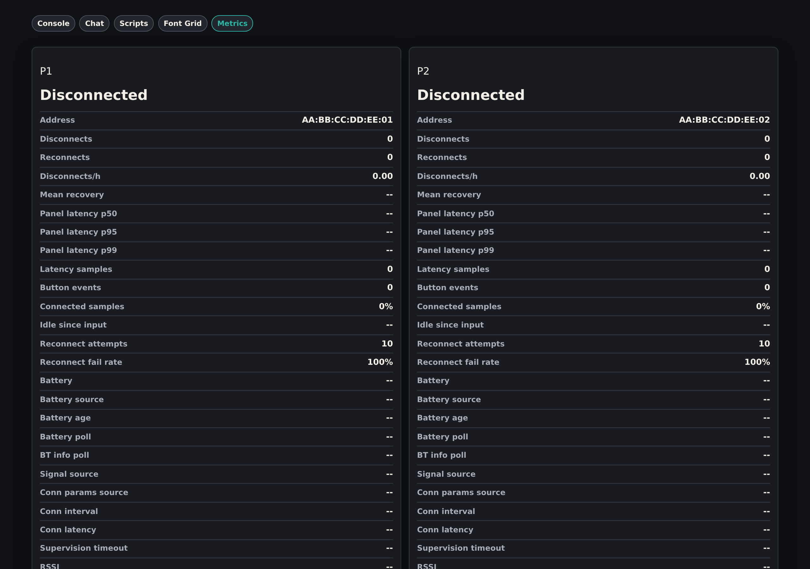
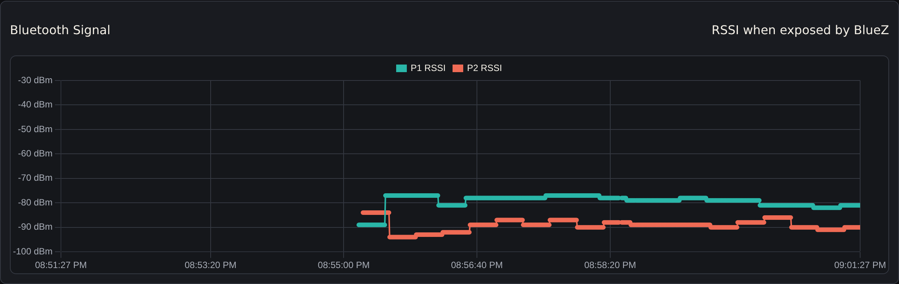

# flipdot

An interactive art installation on a **28×28 flip-dot display** — four stacked AlfaZeta XY5 28×7 modules driven by an NVIDIA Jetson Orin Nano. A webcam feeds MediaPipe pose and face-mesh detection, and the display reacts to whoever walks by: your silhouette becomes a falling-sand toy, walk up close and it draws a live line-art caricature of your face, cross your arms and a menu opens that you operate by hovering your finger. The panel can also be driven by Bluetooth game controllers, a browser console, and AI agents (an in-UI Claude/GPT chat or any external MCP client).

<!-- TODO: photo/GIF of the physical installation -->


*The web console mirroring the panel live — running a "swirl" animation the in-UI AI chat wrote and saved seconds earlier.*

## Modes

| Mode | What it does |
| --- | --- |
| `clock` | Time as a digital or analog face (web-configurable) |
| `sandfall` | Falling-sand toy where your silhouette is a collision obstacle; lit eyes/mouth appear up close |
| `caricature` | Live line-art caricature mirror from face-mesh landmarks + hair segmentation |
| `life` | Conway's Game of Life seeded by your silhouette |
| `tetris` | Playable Tetris with gesture controls |
| `pong` | Pong with smooth, continuous gesture control |
| `tank` | Two-tank combat in the style of Atari *Combat* |
| `percussion` | Play the flip-dot panel as a drum machine (the dots *are* the sound) |
| `autodrum` | Autonomous drum sequencer playing recognizable song patterns |
| `beatmirror` | Dance mode: a mirror that only looks at you on the beat |
| `worldcup` | Live World Cup scores, flashing on goals |
| `board` | Persistent editable board: draw layer plus movable text/image objects |
| `paint` | Free-draw canvas (dwell or controller button to draw) |
| `script` | Runs LLM- or user-authored sandboxed Python animations |
| `menu` | Dwell-activated on-panel menu |
| `pose` | Stick-figure rendering of the detected pose |
| `font_preview` | Compare bitmap font variants side by side |
| `sleep` | Dark idle mode during configured night hours |

## How it works

`flipdot.py` is a single hand-written main loop, no framework. Each iteration reads a webcam frame, runs MediaPipe pose detection, merges input from all sources (gesture, controllers, web, AI) into an event queue, decides the active mode, renders it, and writes the frame to the panel.

The signature interaction is a distance-driven gesture chain: when a person's eyes are visible the display enters **sandfall** with their silhouette; walk close while facing the camera and it transitions into **caricature**, whose face first appears at your real on-panel head position and grows to full size; back away and it shrinks back onto your head and returns to sandfall. Interaction is dwell-based rather than click-based — hover your right index finger over a menu item for two seconds to select it, hold your arms crossed to open the menu.

Everything renders into the universal data type: a `numpy` array of 0/1 dot values, one byte per flip-dot.

```
app/
├── core/            # decision logic (mode manager, transition policy, input hub) — hardware-free, unit-tested
├── modes/           # one renderer class per display mode
├── infrastructure/  # I/O boundaries: camera, panel, FastAPI web server, MCP server, chat backend
└── services/        # pose, drawing primitives, bitmap fonts, weather, controllers, script sandbox, …
web_ui/              # browser console (static HTML/JS/CSS)
flipPyDot/           # vendored fork of the AlfaZeta flip-dot driver (git submodule)
```

## Hardware

- **Display:** 4× AlfaZeta XY5 28×7 flip-dot modules, stacked vertically into a 28×28 panel; RS-485 serial at `/dev/ttyUSB0`, 57600 baud, driven by the vendored [flipPyDot](https://github.com/mdbug/flipPyDot) library through a background writer thread.
- **Compute:** NVIDIA Jetson Orin Nano (JetPack R36, Python 3.10). Pose inference runs on the GPU via a [custom GPU-enabled MediaPipe wheel](https://github.com/mdbug/mediapipe-jetson-gpu) (~5× faster than CPU: 42 ms vs 208 ms per frame).
- **Camera:** any V4L2 webcam at `/dev/video0`.
- **Controllers (optional):** two [IINE GameBrick Mini retro controllers](https://iine.store/products/iine-gamebrick-mini-retro-controller) — credit-card-sized NES-style Bluetooth gamepads (D-pad + A/B) — read via `evdev`, one per player for the two-player games (pong, tank). Any Bluetooth HID gamepad works. A systemd unit disables Bluetooth ERTM, which otherwise causes multi-second input freezes, and the connection tuning in `CONTROLLER_*` env vars helps these low-power pads ride through signal fades.

  

- **Bluetooth:** a [TP-Link UB500 Plus](https://www.tp-link.com/de/home-networking/adapter/ub500-plus/) USB dongle with an external antenna. The Jetson's onboard Bluetooth module has too weak a signal for the low-power controllers across the room, causing constant dropouts — a udev rule ([ops/udev/99-flipdot-disable-onboard-bt.rules](ops/udev/99-flipdot-disable-onboard-bt.rules), installed by `deploy.sh`) disables the onboard radio so the dongle is the only adapter.


None of this is required for development — see below.

## Quick start (no hardware needed)

Requires Python 3.10 and [pipenv](https://pipenv.pypa.io/).

```bash
git clone --recurse-submodules https://github.com/mdbug/flipdot.git
cd flipdot
pipenv install --dev
PREVIEW=true pipenv run python flipdot.py
```

`PREVIEW=true` opens a pygame window simulating the panel instead of writing to serial. Add `ENABLE_WEB_UI=true` and open http://127.0.0.1:8000 for the browser console. MediaPipe `.task` model files are optional — without them the code falls back to the legacy `mp.solutions.pose` API, so pose detection still works on a dev machine.

## Web UI & AI control

With `ENABLE_WEB_UI=true`, a FastAPI server mirrors the live frame to browsers over WebSocket and accepts pointer/click input:

- `/` — live console: watch the panel, click to draw, switch modes, edit the board, configure the clock and sleep schedule
- `/chat` — AI chat that controls the display through tools (Anthropic, OpenAI, or OpenRouter models; bring your own API key)
- `/scripts` — write, run, and save sandboxed Python animations
- `/font-grid` — bitmap font browser
- `/controller-metrics` — live BLE link quality/RSSI for connected gamepads



That conversation produced the animation in the GIF at the top of this page: asked for a mesmerizing looping animation of its own choosing, Claude Fable 5 wrote a sandboxed Python frame generator with `run_script`, looked at the result with `get_display`, refined it twice, and saved the final double-arm spiral as a reusable `swirl` script.

| | |
| --- | --- |
|  |  |
| *Board mode: movable text objects + freehand drawing* | *Settings rail: sleep window, person detection, clock face* |
|  |  |
| *Script browser with saved animations* | *Bitmap font grid comparing glyph variants* |
|  |  |
| *BLE controller link diagnostics* | *Live RSSI history for both gamepads* |

The same tool set (`get_display` as ASCII art, `set_mode`, board drawing, `run_script`, …) is exposed over **MCP** at `/mcp` for external AI agents. The endpoint stays disabled until `MCP_AUTH_TOKEN` is set, and is bearer-token-gated with DNS-rebinding protection.

**Scripted animations** are Python `setup`/`step` frame generators, typically written by the LLM. They run in a four-layer sandbox: an AST allow-list (only `numpy`/`math`/`random`), [bubblewrap](https://github.com/containers/bubblewrap) OS isolation (no network or filesystem; fails closed if `bwrap` is missing), a restricted-builtins subprocess, and rlimits with per-frame timeouts.

## Configuration

All configuration is via `.env` (loaded with `python-dotenv`) — see [.env.example](.env.example) for the annotated full list. Everything is optional; the display runs with no `.env` at all.

| Variable | Purpose |
| --- | --- |
| `PREVIEW` | `true` = pygame preview window instead of serial hardware |
| `CAMERA_INDEX` | V4L2 camera index (default 0) |
| `SLEEP_HOUR_START` / `SLEEP_HOUR_END` | nightly sleep window (default 0–7) |
| `DEBUG`, `LOG_LEVEL` | on-panel debug overlay; log verbosity |
| `ENABLE_WEB_UI`, `WEB_UI_HOST`, `WEB_UI_PORT` | browser console (binds 127.0.0.1:8000 by default) |
| `ANTHROPIC_API_KEY`, `OPENAI_API_KEY`, `OPENROUTER_API_KEY` | enable chat models per provider |
| `ENABLE_MCP`, `MCP_AUTH_TOKEN`, `MCP_ALLOWED_HOSTS` | external MCP endpoint (off until a token is set) |
| `PRIMARY_CONTROLLER_ADDRESS`, `PRIMARY_CONTROLLER_NAME`, `SECONDARY_CONTROLLER_ADDRESS` | Bluetooth gamepads (unset = controllers disabled) |
| `CONTROLLER_SUPERVISION_TIMEOUT_MS`, `CONTROLLER_CONN_MIN_INTERVAL_MS` / `..._MAX_...` | BLE link tuning |
| `OPENWEATHER_API_KEY`, `WEATHER_CITY`, `WEATHER_COUNTRY_CODE` | weather on the clock face (default Berlin/DE) |
| `API_FOOTBALL_API_KEY` | worldcup mode |
| `SANDBOX_MEM_MB`, `SANDBOX_CPU_SECONDS`, `SANDBOX_FRAME_TIMEOUT`, … | script sandbox limits |
| `MEDIAPIPE_MODELS_DIR`, `POSE_MODEL`, `HAIR_SEGMENT_MAX_FPS`, `FOCAL_SCALE` | pose/vision tuning |

## Deployment (Jetson)

Setting the device up from scratch — OS user, Python deps, the GPU MediaPipe wheel, model files, Bluetooth pairing — is covered in **[docs/jetson-setup.md](docs/jetson-setup.md)**. Once the device is prepared, deploys are one command from the repo root:

```bash
./deploy.sh            # rsync to the device, install systemd/udev/logrotate units, restart
```

The service runs as `flipdot.service` (`Restart=always`, logs in `/var/log/flipdot/`).

## Development

```bash
pipenv run pytest                          # Python tests (no hardware/network needed)
npx --prefix web_ui playwright test        # browser UI tests
ruff check . && ruff format --check .      # lint + format
mypy app                                   # type check
npx --prefix web_ui prettier --check web_ui && npx --prefix web_ui eslint web_ui
```

See [AGENTS.md](AGENTS.md) for the full architecture guide, code conventions, and hardware notes (including the MediaPipe GPU wheel build recipe).

## License & credits

[MIT](LICENSE). Built on:

- [FlipPyDot](https://github.com/chrishemmings/flipPyDot) by Chris Hemmings (MIT) — flip-dot driver, vendored as a fork
- [MediaPipe](https://github.com/google-ai-edge/mediapipe) — pose, face-mesh, and hair segmentation
- [marked](https://github.com/markedjs/marked) (MIT) and [DOMPurify](https://github.com/cure53/DOMPurify) (Apache-2.0/MPL-2.0) — chat rendering
- [JetBrains Mono](https://www.jetbrains.com/lp/mono/) (OFL-1.1) — web UI font
